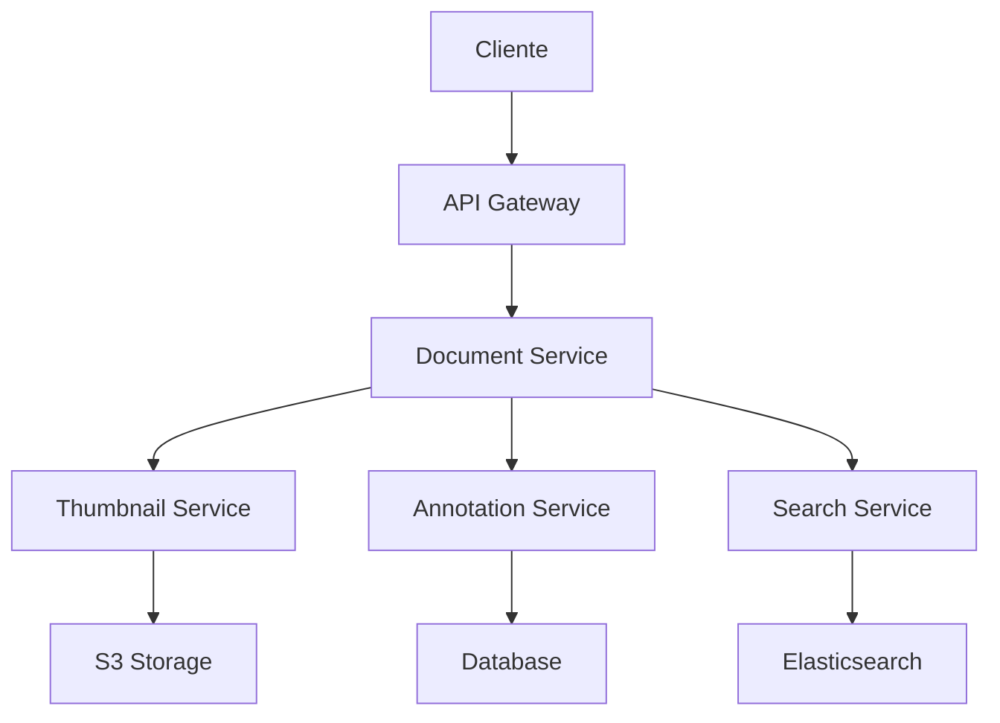
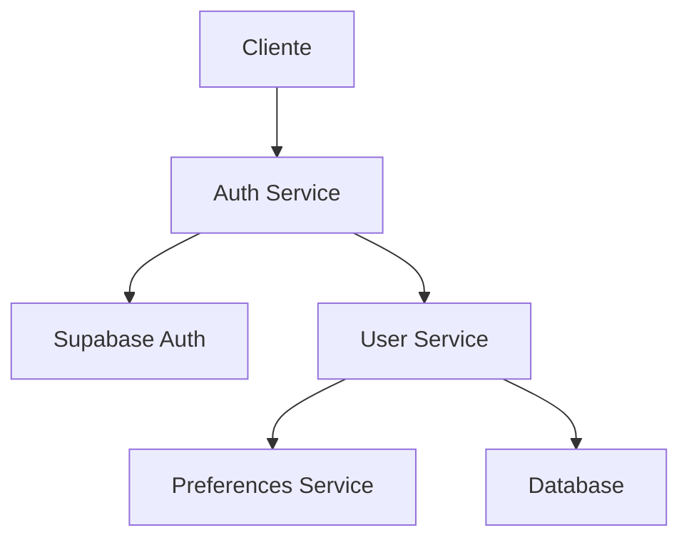
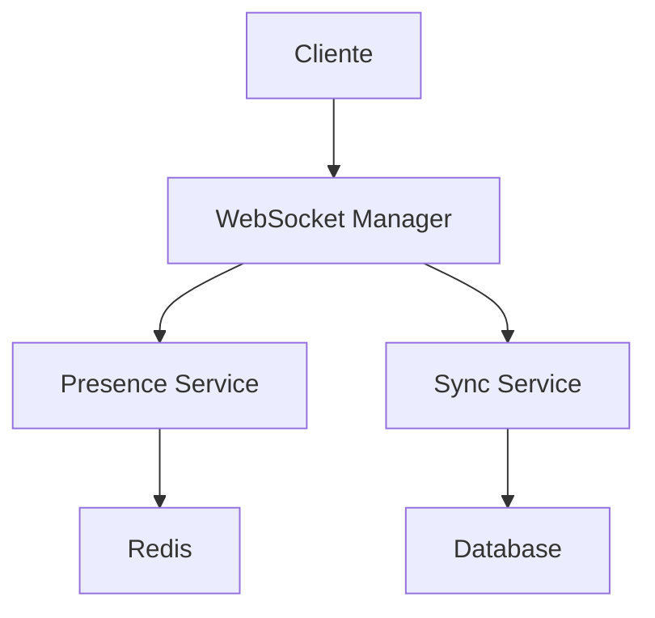

# Arquitectura del Sistema 🏗️

## 1. Visión General

First Court está diseñado como un sistema distribuido moderno que sigue los principios de arquitectura hexagonal y microservicios. El sistema se divide en tres componentes principales:

### 1.1 Agentes Core
- Legal Agent (DeepSeek-R1 37B)
- Documentation Agent (DeepSeek-Coder-V2-Instruct 21B)
- Secretary Agent (DeepSeek-R1-Distill-Qwen-32B)

### 1.2 Sistema de Comunicación
- MessageBroker centralizado
- Colas por agente
- Tipos de mensajes:
  - REQUEST
  - RESPONSE
  - NOTIFICATION
  - UPDATE
  - DECISION
  - ERROR

### 1.3 Integraciones
- Supabase: Auth & Storage
- Google Workspace
- Sistema RAG

## 2. Componentes Principales

### 2.1 Document Viewer

#### Características
- Visor de documentos en tiempo real
- Sistema de miniaturas con caché
- Anotaciones colaborativas
- Búsqueda avanzada

### 2.2 User Management

#### Características
- Autenticación JWT
- Gestión de preferencias
- Sincronización multi-dispositivo
- Control de acceso basado en roles

### 2.3 Real-time Collaboration

#### Características
- Edición colaborativa
- Presencia en tiempo real
- Resolución de conflictos
- Modo offline

## 3. Tecnologías Utilizadas

### 3.1 Backend
- Python 3.11+
- FastAPI
- PostgreSQL
- Redis
- Elasticsearch

### 3.2 Frontend
- Next.js 14
- React
- TailwindCSS
- WebSocket

### 3.3 Infraestructura
- AWS (S3, CloudFront)
- Docker
- GitHub Actions
- Prometheus & Grafana

## 4. Patrones de Diseño

### 4.1 Arquitectónicos
- Hexagonal Architecture
- Event-Driven Architecture
- CQRS
- Repository Pattern

### 4.2 Diseño
- Factory Method
- Observer
- Strategy
- Command

## 5. Seguridad

### 5.1 Autenticación
- JWT con rotación
- OAuth 2.0
- MFA opcional

### 5.2 Autorización
- RBAC (Role-Based Access Control)
- ABAC (Attribute-Based Access Control)

### 5.3 Datos
- Encriptación en reposo
- Encriptación en tránsito
- Sanitización de inputs

## 6. Monitoreo

### 6.1 Métricas
- Latencia de API
- Uso de recursos
- Errores y excepciones
- KPIs de negocio

### 6.2 Logging
- Structured JSON logging
- Log levels
- Trace ID
- Retención configurable

## 7. Escalabilidad

### 7.1 Horizontal
- Stateless services
- Load balancing
- Sharding strategies

### 7.2 Vertical
- Resource optimization
- Caching strategies
- Query optimization

## 8. Decisiones Técnicas

### 8.1 Base de Datos
- PostgreSQL para datos transaccionales
- Redis para caché y tiempo real
- Elasticsearch para búsqueda

### 8.2 Storage
- S3 para documentos y miniaturas
- CDN para assets estáticos
- Backup strategy

### 8.3 API
- REST para operaciones CRUD
- GraphQL para queries complejas
- WebSocket para tiempo real

## 9. Roadmap Técnico

### 9.1 Corto Plazo
- Optimización de caché
- Mejoras en búsqueda
- Integración de nuevos LLMs

### 9.2 Medio Plazo
- Sharding de base de datos
- Mejoras en HA
- Nueva UI

### 9.3 Largo Plazo
- Multi-región
- Edge computing
- AI avanzada
