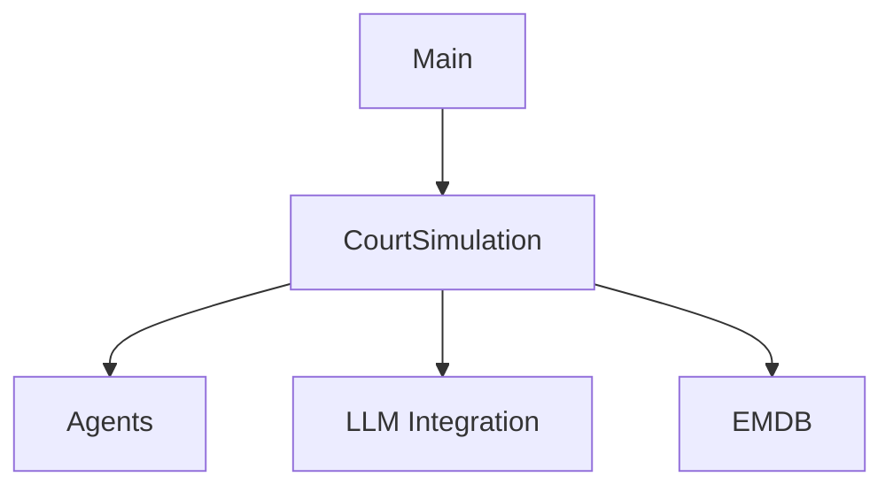
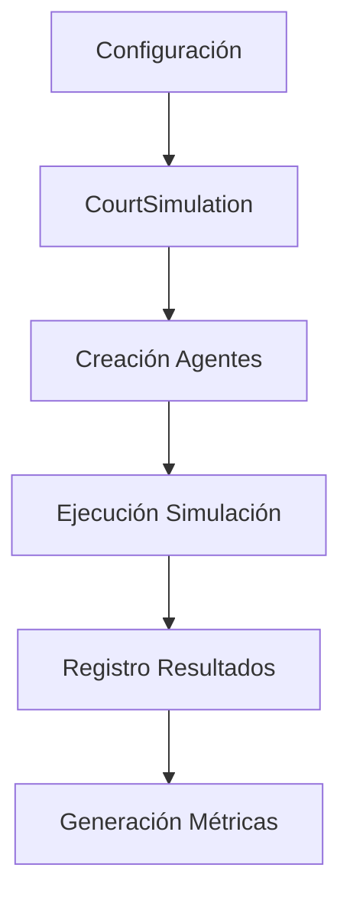

# Análisis Técnico de AgentCourt

## 1. Objetivo del Sistema
Simulación interactiva de procesos judiciales mediante agentes autónomos

## 2. Arquitectura General

## 3. Componentes Clave
### 3.1 CourtSimulation (main.py)
- Configuración inicial
- Gestión de flujo procesal
- Integración con modelos de lenguaje

### 3.2 Sistema de Agentes (agent.py)
- Arquitectura PEAS:
  - Planificación
  - Ejecución
  - Análisis
  - Reflexión

### 3.3 Base de Datos Legal (EMDB/db.py)
- Tipos de colecciones:
  1. Experiencia (casos simulados)
  2. Jurisprudencia
  3. Normativas

## 4. Especificaciones Técnicas
- Requerimientos: Python 3.9+
- Dependencias clave:
  - ChromaDB
  - Transformers
  - Rich

## 5. Proceso de Análisis Realizado

**Metodología de Ingeniería Inversa:**
1. Exploración inicial de estructura de directorios
2. Identificación de componentes clave:
   - Punto de entrada principal (`main.py`)
   - Sistema de agentes autónomos (`agent.py`)
   - Integración con modelos de lenguaje (`LLM/`)
   - Base de datos especializada (`EMDB/`)

**Hallazgos Principales:**
- Arquitectura modular que permite múltiples proveedores de LLM
- Sistema de logging detallado con Rich para monitoreo en tiempo real
- Pipeline completo de simulación judicial (inicialización > debate > sentencia)

**Patrones Detectados:**

**Dependencias Críticas:**
- ChromaDB para almacenamiento vectorial
- Transformers de Hugging Face para modelos locales
- Sistema de plantillas JSON para configuración flexible

**Recomendaciones para Adaptación:**
1. Mantener arquitectura modular principal
2. Extender sistema de base de datos con colecciones chilenas
3. Implementar validadores de formato procesal chileno
