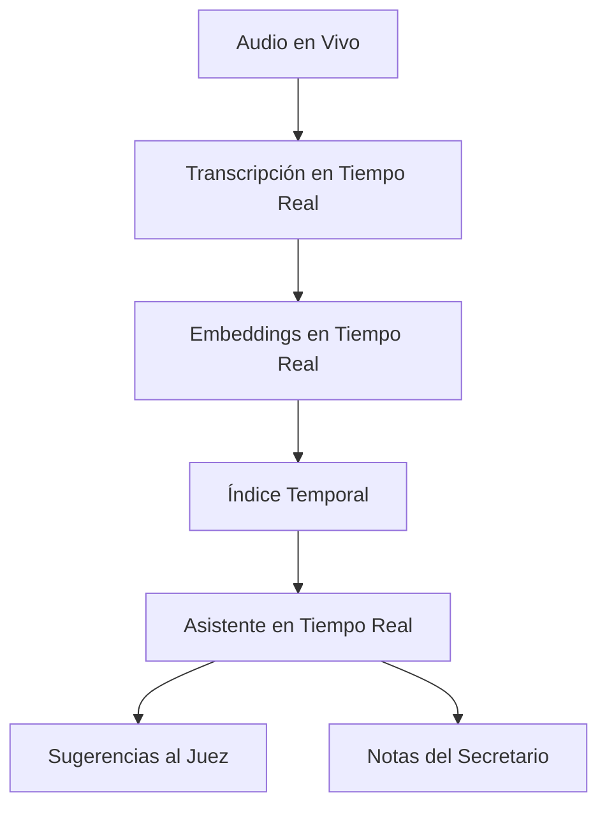
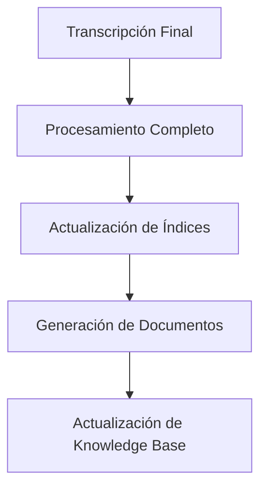

# Arquitectura RAG para el Sistema de Tribunal Autónomo

## 1. Componentes del Sistema RAG

### 1.1 Fuentes de Datos
- **Transcripciones de Audiencias**
  - Audio a texto en tiempo real
  - Metadatos de participantes
  - Timestamps de intervenciones
  
- **Documentos Legales**
  - Actas de audiencias
  - Resoluciones previas
  - Jurisprudencia relacionada
  
- **Metadata Contextual**
  - Información del caso
  - Historial de decisiones
  - Perfiles de participantes

### 1.2 Procesamiento de Datos
- **Preprocesamiento**
  - Limpieza de texto
  - Normalización
  - Extracción de entidades
  
- **Embeddings**
  - Sentence-BERT para español legal
  - Embeddings específicos por tipo de documento
  - Embeddings contextuales

- **Indexación**
  - Índices vectoriales
  - Índices por tipo de documento
  - Índices temporales

### 1.3 Sistema de Recuperación
- **Búsqueda Semántica**
  - Por similitud coseno
  - Por relevancia contextual
  - Por temporalidad
  
- **Filtros Contextuales**
  - Por tipo de caso
  - Por etapa procesal
  - Por participantes

### 1.4 Sistema de Aumentación
- **Enriquecimiento de Contexto**
  - Referencias legales
  - Casos similares
  - Decisiones previas
  
- **Generación de Contenido**
  - Resúmenes automáticos
  - Recomendaciones
  - Borradores de documentos

## 2. Flujo de Trabajo

### 2.1 Durante la Audiencia

### 2.2 Post-Audiencia

## 3. Componentes Técnicos

### 3.1 Vectorización
- **Framework**: Sentence-Transformers
- **Modelo Base**: LegalBERTES
- **Dimensionalidad**: 768
- **Batch Size**: 32

### 3.2 Almacenamiento
- **Vector Store**: FAISS
- **Metadata Store**: PostgreSQL
- **Document Store**: MongoDB
- **Cache**: Redis

### 3.3 Procesamiento
- **Speech-to-Text**: Whisper
- **NER**: Spacy
- **Embeddings**: OpenAI Ada
- **LLM**: GPT-4

## 4. Casos de Uso

### 4.1 Asistencia en Tiempo Real
- Sugerencias de precedentes relevantes
- Alertas de inconsistencias
- Recordatorios de procedimiento
- Detección de puntos clave

### 4.2 Generación de Documentos
- Actas enriquecidas
- Resúmenes automáticos
- Referencias cruzadas
- Borradores de resoluciones

### 4.3 Análisis Post-Audiencia
- Patrones de decisión
- Consistencia de criterios
- Eficiencia procesal
- Mejoras sugeridas

## 5. Implementación Propuesta

### Fase 1: Base RAG
1. Implementar transcripción en tiempo real
2. Crear índices vectoriales básicos
3. Integrar con templates existentes
4. Implementar búsqueda básica

### Fase 2: Enriquecimiento
1. Añadir análisis de entidades
2. Implementar referencias cruzadas
3. Mejorar búsqueda contextual
4. Integrar generación de documentos

### Fase 3: Tiempo Real
1. Implementar sugerencias en vivo
2. Añadir análisis de sentimiento
3. Implementar detección de eventos clave
4. Integrar con sistema de decisiones

## 6. Métricas de Evaluación

### 6.1 Calidad de Recuperación
- Precisión
- Recall
- MRR (Mean Reciprocal Rank)
- NDCG (Normalized Discounted Cumulative Gain)

### 6.2 Calidad de Generación
- ROUGE Score
- BLEU Score
- Evaluación humana
- Consistencia legal

### 6.3 Rendimiento del Sistema
- Latencia
- Throughput
- Uso de recursos
- Tiempo de indexación

## 7. Consideraciones

### 7.1 Privacidad y Seguridad
- Encriptación de datos
- Control de acceso
- Auditoría de uso
- Cumplimiento GDPR

### 7.2 Escalabilidad
- Sharding de índices
- Procesamiento distribuido
- Caché inteligente
- Load balancing

### 7.3 Mantenimiento
- Actualización de índices
- Limpieza de datos
- Monitoreo de calidad
- Backup y recuperación
